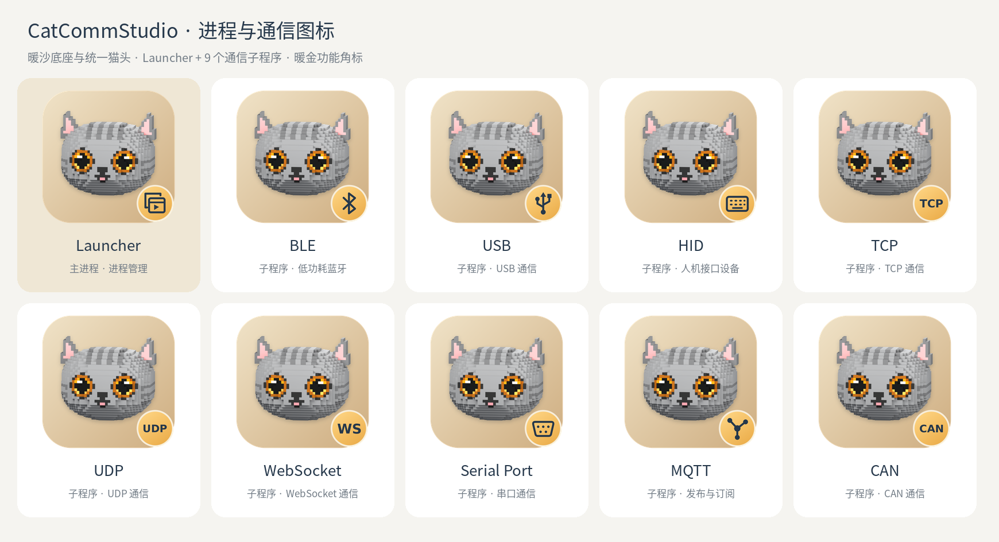
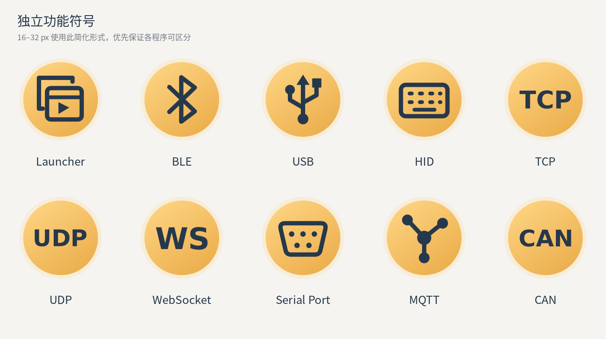

# CatCommStudio · 进程与通信子程序 Logo

根据已定版基础 Logo 扩展的 **10 个图标**：Launcher 主进程，以及 BLE、USB、HID、TCP、UDP、WebSocket、Serial Port、MQTT、CAN 九个子程序。用户已确认原输入 `mptt` 指 **MQTT**。本次按用户要求统一改为暖沙底色，并新增 CAN 通信图标。

本轮扩展已由用户确认。基础猫头、底座和配色沿用定版文件；角色与名称按本次指示标注，不表示程序已经实现或能力已在各平台验证。



## 素材入口

每个模块均提供完整 SVG、简化 SVG、10 种尺寸 PNG 和 Windows ICO。下表的 PNG 链接为 1024 px 完整猫头版。

| 模块 | 角标设计 | PNG | SVG | ICO |
| --- | --- | --- | --- | --- |
| Launcher | 叠放窗口与运行控制，表达进程管理 | [PNG](launcher/png/catcommstudio-launcher-1024.png) | [SVG](launcher/catcommstudio-launcher.svg) | [ICO](launcher/catcommstudio-launcher.ico) |
| BLE | 蓝牙符号 | [PNG](ble/png/catcommstudio-ble-1024.png) | [SVG](ble/catcommstudio-ble.svg) | [ICO](ble/catcommstudio-ble.ico) |
| USB | USB 分支符号 | [PNG](usb/png/catcommstudio-usb-1024.png) | [SVG](usb/catcommstudio-usb.svg) | [ICO](usb/catcommstudio-usb.ico) |
| HID | 键盘轮廓，代表人机接口设备 | [PNG](hid/png/catcommstudio-hid-1024.png) | [SVG](hid/catcommstudio-hid.svg) | [ICO](hid/catcommstudio-hid.ico) |
| TCP | TCP 缩写 | [PNG](tcp/png/catcommstudio-tcp-1024.png) | [SVG](tcp/catcommstudio-tcp.svg) | [ICO](tcp/catcommstudio-tcp.ico) |
| UDP | UDP 缩写 | [PNG](udp/png/catcommstudio-udp-1024.png) | [SVG](udp/catcommstudio-udp.svg) | [ICO](udp/catcommstudio-udp.ico) |
| WebSocket | WS 缩写 | [PNG](websocket/png/catcommstudio-websocket-1024.png) | [SVG](websocket/catcommstudio-websocket.svg) | [ICO](websocket/catcommstudio-websocket.ico) |
| Serial Port | 串口接口轮廓 | [PNG](serial-port/png/catcommstudio-serial-port-1024.png) | [SVG](serial-port/catcommstudio-serial-port.svg) | [ICO](serial-port/catcommstudio-serial-port.ico) |
| MQTT | 消息节点与分发连接，表达发布／订阅 | [PNG](mqtt/png/catcommstudio-mqtt-1024.png) | [SVG](mqtt/catcommstudio-mqtt.svg) | [ICO](mqtt/catcommstudio-mqtt.ico) |
| CAN | CAN 缩写，与 TCP、UDP 使用同类识别方式 | [PNG](can/png/catcommstudio-can-1024.png) | [SVG](can/catcommstudio-can.svg) | [ICO](can/catcommstudio-can.ico) |

HID 和串口图形是识别用的设备示意，不限定实际设备种类或接口针脚配置。

## 尺寸策略

- **48、64、128、256、512、1024、2048 px**：完整定版猫头与右下角功能角标。
- **16、24、32 px**：使用独立暖金功能符号，优先保持不同程序的辨识度。
- **ICO**：包含 16、24、32、48、64、128、256 px，按上述规则切换构图。
- 每个模块的 `catcommstudio-{模块}.svg` 为完整构图；`catcommstudio-{模块}-compact.svg` 为简化构图。应用也可根据具体界面选择 SVG 构图，不受 PNG 的推荐尺寸切换规则限制。



[查看实际尺寸与深色背景效果](size-review.png)。小尺寸适配仅用于本轮扩展图标，不改动无角标基础定版的任何尺寸。

## 视觉规范与维护

完整图标使用暖沙基础定版 SVG 的所有原有图层，只追加角标。底座渐变为 `#F0E3C8 → #CEAD80`；角标沿用 `(425, 425)` 的中心、`67` 的外圈半径、暖金渐变、浅米色边缘与深石墨蓝符号。所有模块共用同一套颜色，通过符号区别。

完整 SVG 的猫头、阴影为内嵌 PNG，其余底座和角标为矢量。TCP、UDP、WS、CAN 的文字已转为路径，无需字体即可显示。简化 SVG 和 `glyphs/` 内的独立符号均为纯矢量。

```sh
/usr/bin/python3 assets/brand/extensions/generate.py
```

依赖 Pillow、PyCairo、PyGObject、librsvg、DejaVu Sans Bold 与 Noto Sans CJK 字体。脚本读取 `../final/catcommstudio.svg` 与 `../final/palette.json`，不修改基础定版。符号定义位于脚本的 `glyphs()` 中；`glyphs/*.svg` 为导出的独立编辑素材，重运行脚本会按脚本中的定义重新生成。

`manifest.json` 记录模块、角色、各素材路径、小尺寸规则和所用基础 SVG 的 SHA-256，方便后续接入。当前尚未接入应用。

已检查暖沙完整图标、独立符号和实际小尺寸效果；100 张 PNG 的尺寸、RGBA 与透明边角检查通过；10 个 ICO 各包含 7 个尺寸，所有图像与对应 PNG 像素一致。所有完整扩展图标相较暖沙基础图标仅在角标区域内发生变化，猫头及原有布局未修改。
