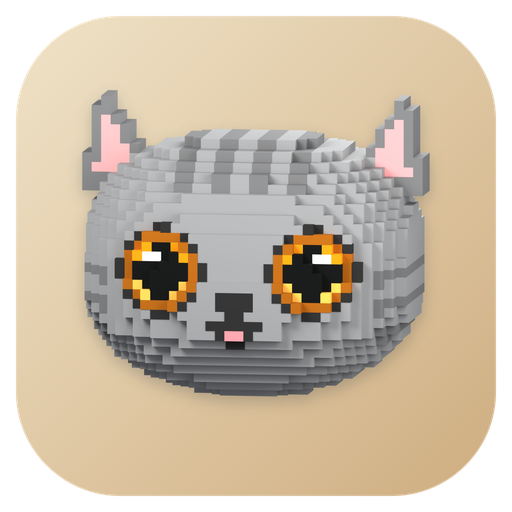

# CatCommStudio · 定版 Logo

**状态：已由用户于 2026-09-23 确认定版，底色按最新指示统一更新为暖沙色。** 当前正式 Logo 为无角标基础版：暖沙圆角矩形底座与 CatGray 原体素模型猫头。后续在同一基础版上扩展不同角标。



## 使用文件

| 文件 | 用途 |
| --- | --- |
| [catcommstudio.svg](catcommstudio.svg) | 可编辑底座、图层与位置；猫头和阴影为内嵌 PNG，非纯矢量猫头 |
| [catcommstudio.ico](catcommstudio.ico) | Windows 图标，含 16、24、32、48、64、128、256 px |
| [2048 px PNG](png/catcommstudio-2048.png) | 高清基础 Logo，圆角外透明 |
| `png/catcommstudio-{尺寸}.png` | 16、24、32、48、64、128、256、512、1024、2048 px |
| [palette.json](palette.json) | 定版颜色、布局与预留角标参数 |
| [猫头 Blender 场景](source/catgray-head.blend) | 定版猫头几何、材质、摄影机和灯光 |
| [透明猫头](source/catgray-head.png) | 定版使用的 2048 px 模型渲染图 |
| [空白角标模板](templates/badge.svg) | 与定版配套的暖金角标底座，符号留空 |
| [export.py](export.py) | 从定版 SVG 导出 PNG 和 ICO |

## 定版规范

- 底座：暖沙渐变 `#F0E3C8 → #CEAD80`。
- 猫头：沿用原模型的灰色、金色眼睛、粉色内耳、条纹和默认表情。
- 512 × 512 画布中，底座位置为 `(16, 16)`，尺寸为 `480 × 480`，圆角半径为 `104`。
- 猫头宽度约占画布的 68%，包围盒中心位于画布高度的 47.5%。
- 当前正式基础版不带角标。后续角标沿用右下角位置与暖金配色 `#FFD787 → #ECAF4D`；以 `(425, 425)` 为中心，外圈半径 `67`，浅米色边缘为 `#F7EDD9`，深色符号为 `#26384B`。

后续在角标模板的 `badge-glyph` 分组内添加符号，具体图形与含义分别确认。本目录中的所有尺寸均为无角标基础版；[Launcher 与通信子程序扩展](../extensions/README.md) 单独存放，并采用各自的小尺寸适配规则。

## 维护与导出

`final/` 是完整的定版素材目录，不依赖其他设计版本。SVG 内嵌猫头与阴影图像，可独立使用。

在仓库根目录执行以下命令，可从定版 SVG 重新导出本目录的 PNG 与 ICO：

```sh
/usr/bin/python3 assets/brand/final/export.py
```

也可加 `--output /path/to/output` 导出到其他目录。依赖 Pillow、PyGObject 与 librsvg。导出脚本只处理当前定版，不生成备选配色或角标方案。

Blender 场景使用相对输出路径 `//catgray-head.png`，可用于后续模型维护。若重新渲染猫头，需在 SVG 中同步更新内嵌猫头图像，再执行导出；PNG 源文件不会自动更新 SVG。

本次暖沙底色更新后，已核对基础 PNG 尺寸、RGBA、透明边角及 ICO 七个尺寸与 PNG 的像素一致性；猫头源模型、透明渲染图和 SVG 内嵌的猫头与阴影数据保持不变。设计已定版，应用接入另行执行。
