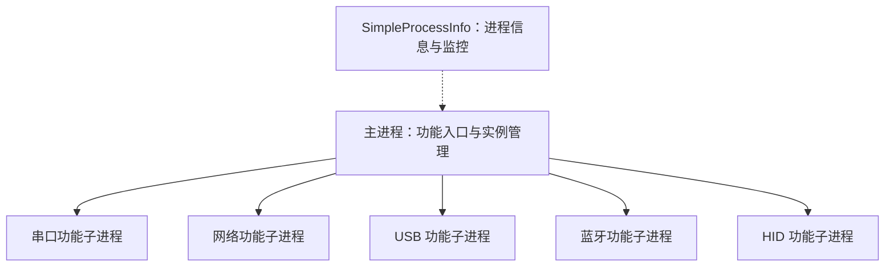

# 多进程架构与基础库职责

日期：2026-09-22。状态：已确认架构方向与集成建议，尚未实现或进行进程联调。

## 1. 已确认的方向

- CatCommStudio 采用多进程设计。
- 主进程主要负责创建或打开串口、网络、USB、蓝牙、HID 等通信功能子进程。
- 通信核心复用用户已实现的 SimpleCommKit。
- 用户已实现 SimpleScriptEngine，并提供 SimpleProcessInfo 作为进程相关能力的参考。

“功能子进程”目前表示职责划分，不代表每种通信只能有一个进程，也不代表一个会话必须对应一个进程。实例数量、会话归属、窗口组织和 IPC 方案尚待确认。

## 2. 基础库核对范围

本次 GitHub 页面未能读取，SimpleScriptEngine 与 SimpleProcessInfo 的核对依据为本机对应仓库的本地检出版本；不将其视为远端最新版本。仅阅读公开接口、相关实现和构建配置，未编译、运行测试或进行设备与多进程联调。

| 基础库 | 核对版本 | 已有能力 | 集成边界 |
| --- | --- | --- | --- |
| [SimpleCommKit][comm] | `fc13bff9c71c911b18579afe95a8f71a5cbf1c32`，沿用通信能力文档的核对结果 | 多种通信方式的设备发现、连接与收发接口 | 会话、任务和进程生命周期由应用层管理 |
| [SimpleScriptEngine][script] | `f9d1b98afac39f950ef2734195abc2fd9e486450` | 多引擎适配、脚本执行、函数注册与调用、全局变量、错误回调；QuickJS 适配器内部处理待执行任务 | 宏录制、通信脚本 API、宿主异步桥接和执行取消仍需设计 |
| [SimpleProcessInfo][process] | `980e77a09a12330f0c9673a02c68ea1d59c4e5c1` | 进程查询、子进程发现、存活检查、CPU/内存等采样及后台轮询监控 | 当前公开接口未提供子进程启动、关闭或 IPC；进程存在也不表示通信功能已就绪 |

SimpleScriptEngine 当前构建配置使用 QuickJS-NG `0.15.1`。后续绑定与扩展应以实际依赖版本为准，不能直接套用其他 QuickJS 版本的接口假设。

SimpleProcessInfo 的进程事件回调在后台线程触发。主进程展示这些信息时需转交到 UI 线程，并区分采样得到的进程状态与应用通过 IPC 报告的功能状态。CPU 口径和各平台可获取字段需在选定集成版本后核实。

## 3. 进程职责建议

以下为设计建议；图中的子进程代表功能类别，不限定实例数量或可执行文件的拆分方式。

| 部分 | 建议职责 |
| --- | --- |
| 主进程 | 提供创建或打开功能的入口，管理实例与配置入口，展示运行状态；资源占用展示可使用 SimpleProcessInfo |
| 功能子进程 | 持有所属通信资源，通过 SimpleCommKit 操作设备，维护会话、收发记录、指令与本地任务 |
| 宏与脚本 | 单个功能内的宏优先由所属子进程录制和执行，使用 SimpleScriptEngine 调用应用层通信接口 |
| 进程控制与 IPC | 由应用层实现启动、实例登记、就绪通知、状态交换、关闭请求与退出处理，具体技术待定 |
| 界面 | 各功能复用组件和交互规则；子进程是否有独立窗口、主界面如何导航尚待确认 |

这种划分预期缩小通信故障或脚本故障的影响范围，但脚本若与通信运行在同一子进程，仍可能影响该进程的通信与界面。是否进一步拆出脚本执行进程，应根据实际隔离需求决定。

## 4. 宏与脚本的归属建议

单功能宏建议按“用户操作 → 业务命令记录 → 可编辑步骤 → 脚本执行 → 所属会话通信”的流程实现。步骤数据保存逻辑会话及操作目标，在运行时绑定实际设备和连接；PID 用于定位当前进程实例，不作为持久化会话身份。

SimpleScriptEngine 已提供 `registerFunction()`、`executeString()`、`executeFile()`、`call()` 等基础接口。当前注册回调同步返回 `SimpleScriptValue`；QuickJS 内部的任务队列处理还需要与宿主通信完成事件、定时器及取消机制衔接，才能形成完整的异步宏运行流程。前期讨论的 `await comm.sendHex()` 等写法属于待实现的应用 API。

若采用 Qt，建议让脚本运行在所属子进程的专用工作线程中，并把同一引擎实例的操作集中在该线程。主进程主要接收运行状态与结果摘要；是否需要汇总原始收发数据，按实际需求确定。

跨功能宏，例如“串口发送后等待网络响应”，需要额外的跨进程协调、请求关联、超时和取消机制。协调逻辑放在主进程还是专用任务进程，以及该能力是否属于首版，均待确认。

## 5. 生命周期与状态建议

建议区分三个层次的状态：

- 进程状态：未启动、启动中、运行中、已退出。
- 功能状态：初始化中、就绪、关闭中、故障或失联。
- 会话状态：未连接、连接中、已连接或监听中、已断开。

主进程启动子进程后，建议等待带实例标识的就绪通知，再开放对应操作；存在 PID 或收到进程监控的 `Started` 事件不足以证明初始化完成。主进程发出的请求和子进程返回的结果需要关联标识，重启后应能识别旧实例的迟到消息。

关闭时建议先请求停止宏任务、结束通信并保存必要状态，再等待子进程退出。等待超时后的处理、主进程退出是否保留子进程，以及是否允许独立启动功能进程，需明确产品规则。

子进程异常退出时，建议主进程保留错误与配置入口，允许重新打开功能；恢复配置和重新执行宏应分开处理。发送是否已到达设备可能无法从进程退出事件判断，恢复后宏从何处开始需单独定义。

## 6. 待确认与验证

1. 实例粒度：按通信类型、窗口还是会话创建进程？同类功能是否允许多个实例？
2. 展现方式：“打开”已有功能是激活独立窗口，还是在主界面呈现对应视图？
3. 生命周期：关闭窗口、关闭会话和退出进程如何对应？主进程退出时如何处理子进程？
4. IPC：需要哪些控制与状态消息，是否传输原始收发数据，如何处理超时与失联？
5. 自动化：首版是否提供单功能宏，是否需要跨功能宏或独立脚本进程？
6. 平台验收：验证子进程启动与就绪、设备占用、正常关闭、异常退出、状态采样，以及其他功能实例在故障后的可用性。

这些事项是后续设计和验收工作，不表示当前已经具备相关实现。

[comm]: https://github.com/graycatya/SimpleCommKit/tree/fc13bff9c71c911b18579afe95a8f71a5cbf1c32
[script]: https://github.com/graycatya/SimpleScriptEngine/tree/f9d1b98afac39f950ef2734195abc2fd9e486450
[process]: https://github.com/graycatya/SimpleProcessInfo/tree/980e77a09a12330f0c9673a02c68ea1d59c4e5c1
